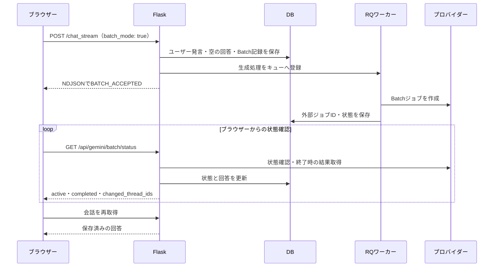

# Batch処理の機能と実装

AI Chat PlaygroundのBatch処理について、利用方法、処理の流れ、データ構造、コード配置を解説します。対象は2026年9月14日時点のリポジトリ実装です。ここで示すモデル判定やサイズ制限はアプリ側の実装であり、各プロバイダーが提供する最新の対応範囲・料金・完了時間を保証するものではありません。

## 1. Batch処理とは

Batchを有効にすると、チャットの生成要求をGemini、OpenAI、xAIのBatch APIへ非同期ジョブとして送信します。通常のチャットのように回答本文を逐次受信せず、受付後は状態を表示し、結果を取得できた時点で会話内の回答を更新します。

現在は**チャットの送信1回につき、外部Batchジョブ1件・生成リクエスト1件**を作成します。複数のチャットをまとめて1つのBatchへ集約したり、CSVから大量の要求を登録したりする仕組みではありません。会話履歴や添付を含む1回の生成要求が処理単位です。

サーバー内のRQによるバックグラウンド実行と、プロバイダーのBatch実行は別段階です。RQワーカーは入力を準備して外部ジョブを登録し、外部ジョブの完了を待ち続けることなく送信処理を終えます。

## 2. 利用方法と対応範囲

1. 対応モデルを選択し、入力欄付近の「Batch」を有効にします。
2. メッセージを送信すると、会話に準備中・待機中などの状態が表示されます。
3. 状態確認で結果が取得されると、同じ会話の回答欄が更新され、通知バナーが表示されます。
4. サイドバーの「Batch処理」から一覧を開けます。一覧には全件・実行中・終了のフィルターがあり、チャットを開く、停止する、終了した履歴を削除する操作ができます。

| 系統 | アプリの受付条件 | 主な除外条件 |
|---|---|---|
| Gemini | 登録済みの`gemini-`モデル。Gemini APIモードのみ | embedding、video、veo、music、lyria、native-audio、tts、live、transcribe、agent、deep-research、robotics、computer-useを名前に含むもの |
| OpenAI | 登録済みの`gpt-`モデル | image、audio、tts、transcribe、realtime、searchを名前に含むもの |
| xAI | 登録済みの`grok-`モデル | image、video、voice、audio、tts、realtimeを名前に含むもの |

判定元は`server/routes_chat.py`の`_is_gemini_batch_model`、`_is_openai_batch_model`、`_is_xai_batch_model`です。フロント側にも表示用の`isBatchModelKey`がありますが、受付時にはサーバーが登録済みモデルかどうかを含めて再判定します。名前による判定を通っても、プロバイダー側の対応状況や利用権限によって送信が失敗する場合があります。

画像入力は対象モデルに応じて利用します。Geminiには画像生成用のBatch送信分岐と、結果のインライン画像を保存する処理もあります。OpenAIの画像専用モデルとxAIの画像・動画モデルは上記判定で除外されます。

BatchではCoding Modeを利用できません。また、ワーカーは検索、URL context、Maps、Python、ファイル作成、MCPを無効にし、自動URL検索などの補助処理も抑止します。対話途中のツール実行を前提とした処理は行いません。ブラウザー高速モードとの併用も制御され、Batch送信はサーバー経由になります。

## 3. 全体の処理フロー



### 受付と回答欄の先行作成

`/chat_stream`はモデル・認証情報・モードの条件を確認し、ユーザー発言と空のassistantメッセージを作成します。assistantの`parent_id`は今回のユーザー発言です。続いて両者を参照する`GeminiBatchJob`を`JOB_STATE_QUEUED`で保存します。

受付応答は`application/x-ndjson`で、スレッドID、アプリ内ジョブID、状態テキスト、`done: BATCH_ACCEPTED`を返します。この`done`は受付通信の終了を表し、外部Batch処理の完了を意味しません。外部ジョブIDは後からワーカーが取得します。

受付には通常チャットと共通の送信識別・冪等制御を利用します。一方、通常生成用のRedisの`pending_job`記録はBatchには作らず、継続状態はDBのBatch記録から取得します。

### プロバイダーへの送信

`server/background.py`の`background_chat_task`内で会話・入力を組み立て、各`_submit_*_batch`へ分岐します。

| 系統 | 送信方法 | アプリが設定・検査する値 |
|---|---|---|
| Gemini | Google Gen AI SDKの`batches.create`へ`src=[request]`を渡す | シリアライズしたインライン要求が`20 * 1024 * 1024`バイト以下 |
| OpenAI | 1行のJSONLをFiles APIへアップロードし、`batches.create`で`/v1/responses`を指定 | `purpose='batch'`、`completion_window='24h'`、JSONLが`200 * 1024 * 1024`バイト以下 |
| xAI | Batch作成後、そのBatchの`/requests`へ1件を追加 | `batch_request_id=job_id`、要求が`25 * 1024 * 1024`バイト以下 |

サイズはファイル添付単体ではなく、それぞれコード内でJSON化した対象のバイト数です。OpenAIとxAIは`stream`を取り除きます。OpenAIには`store=False`を設定し、xAIには`store`を渡しません。

以下は送信形式の理解用に縮約したコードです。単独で実行するサンプルではなく、認証、入力生成、DB更新、例外処理を省略しています。

```python
# Gemini: 生成要求を1件インラインで登録
g_client.batches.create(model=provider_model, src=[request], config=config)

# OpenAI: 1行のJSONLにするレコード
batch_line = {
    'custom_id': job_id,
    'method': 'POST',
    'url': '/v1/responses',
    'body': request_body,
}

# xAI: Batch作成後に追加する要求
batch_request = {
    'batch_request_id': job_id,
    'batch_request': {'responses': request_body},
}
```

送信に成功すると`provider_job_name`を保存します。失敗時は`_persist_batch_failure`がジョブを失敗状態にし、先に作成した回答欄へエラーを保存します。

## 4. 状態確認・結果取得・通知

`refreshGeminiBatchStatus`は初回に実行され、その後2秒間隔のタイマーで状態確認を試みます。前の確認処理が進行中なら重ねて実行しません。このため、通信や結果取得が長引いた場合に必ず2秒ごとに更新されるわけではありません。

名前に`Gemini`が残っていますが、`GET /api/gemini/batch/status`は3系統共通です。ログインユーザーの未終了または未通知のジョブを古い順に最大50件取得し、外部状態を照会します。

| 共通状態（`JOB_STATE_`に続く名前） | 意味 |
|---|---|
| `QUEUED` | アプリ側の準備・送信待ち |
| `VALIDATING` | 外部で入力検証中 |
| `PENDING` | 外部に送信済み、処理待ち |
| `RUNNING` | 外部で処理中 |
| `FINALIZING` | 結果準備中、または終了後の結果取得を再試行中 |
| `CANCELLING` | キャンセル処理中 |
| `SUCCEEDED` / `FAILED` / `CANCELLED` / `EXPIRED` | 終了状態 |

各プロバイダーが必ず全状態を通るわけではありません。Geminiの列挙値やREST形式は`_normalize_batch_state`で正規化し、Operation形式は`metadata.state`や`done`・`response`・`error`から判断します。OpenAIの`completed`なども共通状態へ変換します。xAIは`num_pending`、`num_success`、`num_error`、`num_cancelled`などの集計値から判定します。

### 結果の取り込み

- Gemini：インライン応答と結果ファイルの両方に対応します。JSONLでは最初の有効な結果を読み、本文、思考テキスト、インライン画像、出力・思考トークンを取り込みます。
- OpenAI：`output_file_id`から結果JSONLを取得し、最初の有効なオブジェクトのResponses本文と出力トークンを保存します。失敗時には`error_file_id`の参照経路もあります。
- xAI：結果一覧をページ送りし、`batch_request_id`がアプリ内の`job_id`と一致する結果を探します。Chat Completions形式とResponses形式の本文抽出に対応します。

Gemini・OpenAIで最初の結果を使う実装は、1ジョブ1要求という前提に依存します。将来複数要求へ拡張する場合は、結果とメッセージの対応付けも変更が必要です。

回答は新しいメッセージを追加するのではなく、`assistant_message_id`が指す既存メッセージへ保存します。本文などの暗号化は、そのメッセージの`is_encrypted`に従います。

状態取得時に終了を検出すると`completed_at`を設定し、通知対象には`notified_at`を設定して`completed`へ返します。ブラウザーはバナーを表示し、現在開いている会話の結果なら会話を再読込します。`completed`には成功以外の終了状態も含まれるため、成否は会話や一覧の状態で確認します。

`notified_at`はサーバーが通知対象として返した記録であり、ユーザーがバナーを見たことを確認する既読記録ではありません。

### 画面を閉じたとき

外部へ登録済みのBatchはブラウザーを閉じても、それだけではキャンセルされません。ただし、この実装の結果取得とDBへの反映は状態確認APIへのアクセスを契機に行います。画面を閉じている間にも常駐ワーカーが結果を回収し続ける仕組みではありません。再度アプリを開き、状態確認が成功すると結果が反映されます。

## 5. 一覧・停止・削除のAPI

以下はアプリ内部のAPIです。ログインセッションが必要で、変更操作にはアプリ共通のリクエスト保護が適用されます。プロバイダーのAPIキーを付けて直接利用する公開Batch APIではありません。

| メソッド・パス | 処理 |
|---|---|
| `POST /chat_stream` | `batch_mode: true`でチャット要求を受け付ける |
| `GET /api/gemini/batch/status` | 外部状態を確認し、結果を保存して`active`、`completed`、`changed_thread_ids`を返す |
| `GET /api/batch/jobs` | 現ユーザーのDB履歴を新しい順に最大500件返す |
| `POST /api/batch/jobs/<job_id>/cancel` | 現ユーザーの実行中ジョブにキャンセルを要求する |
| `DELETE /api/batch/jobs/<job_id>` | 現ユーザーの終了済みBatch履歴を1件削除する |

一覧モーダルは表示中、5秒間隔でDB履歴を再取得します。一覧取得APIそのものはプロバイダーの状態を更新しません。外部状態の更新は別の2秒間隔の状態確認が担います。

停止は外部ジョブIDの取得後に利用できます。プロバイダーへのキャンセル要求が成功すると、アプリは直ちに`CANCELLED`とし、回答欄を停止表示へ更新して通常の追跡を終了します。外部側の停止完了を追跡し終えてから表示しているわけではありません。

履歴削除はBatch管理レコードのみが対象です。会話の回答メッセージや外部の入力・結果ファイルを削除するAPIではありません。実行中の履歴は削除できず、先に停止が必要です。また、スレッドとBatch記録には削除連動の関連付けがあるため、スレッドを削除した場合にもローカルのBatch記録は残りません。ローカル記録の削除を外部Batchの停止の代わりにはしないでください。

## 6. データ構造

モデル名は`GeminiBatchJob`、テーブル名は`gemini_batch_job`ですが、Gemini専用ではありません。`provider`で`gemini`・`openai`・`xai`を識別します。

| フィールド | 用途 |
|---|---|
| `job_id` | アプリ内の一意なジョブ識別子 |
| `user_id` / `thread_id` | 所有者と会話への関連付け |
| `user_message_id` / `assistant_message_id` | 入力発言と結果を書き込む回答欄 |
| `provider` / `model` | 送信先とモデル |
| `provider_job_name` | 外部ジョブID・リソース名。登録完了までは空 |
| `output_file_id` / `error_file_id` | プロバイダーの結果ファイル参照 |
| `state` / `status_text` / `error` | 共通状態、表示文言、エラー詳細 |
| `created_at` / `updated_at` | 作成・更新時刻 |
| `completed_at` / `notified_at` | 終了・通知対象化の時刻 |

APIキーはこのBatchテーブルには保存しません。送信、状態確認、停止では共通の認証解決処理を使います。後から利用キーやGeminiの接続モードが変わり、外部ジョブへアクセスできなくなると、結果取得や停止に失敗する可能性があります。

## 7. ファイル配置と読む順序

パスはリポジトリのルートからの相対パスです。行番号は変更でずれやすいため、関数名を検索の目印にしてください。

| ファイル名 | 主な内容 | いつ開くか |
|---|---|---|
| `server/routes_chat.py` | `_is_*_batch_model`、受付、`gemini_batch_status_api`、一覧・停止・削除 | 全体の入口、状態・結果反映を調べるとき |
| `server/background.py` | `background_chat_task`内の`_submit_gemini_batch`、`_submit_openai_batch`、`_submit_xai_batch`、`_persist_batch_failure` | 送信形式、入力制限、送信失敗を調べるとき |
| `server/models.py` | `GeminiBatchJob`と`Thread.batch_jobs` | DB項目と関連付けを調べるとき |
| `server/routes_files.py` | 会話取得時の`batch_job`付与 | 会話の状態表示を調べるとき |
| `static/js/chat_core_parts/chat_core.part06_model_media_prompt_cache.js` | `isBatchModelKey`、`updateBatchUi` | モデルごとのBatch表示、高速モード制御を調べるとき |
| `static/js/chat_core_parts/chat_core.part13_canvas_coding_stream.js` | Batch状態を含む会話表示 | 待機中の回答欄を調べるとき |
| `static/js/chat_core_parts/chat_core.part14_send_message_browser_fast.js` | `sendMessage`の`batch_mode`送信、受付後の処理 | ブラウザーの送信経路を調べるとき |
| `static/js/chat_core_parts/chat_core.part15_slash_tempchat_threads.js` | `refreshGeminiBatchStatus`、`showGeminiBatchCompletionBanner` | ポーリングと通知を調べるとき |
| `static/js/chat_core_parts/chat_core.part16_gems_branch_debug.js` | `loadBatchJobs`、`renderBatchJobs`、停止・履歴削除 | 一覧画面の動作を調べるとき |
| `templates/chat/composer_controls.html` | Batchチェックボックス | 送信オプションのHTMLを調べるとき |
| `templates/chat/sidebar.html` | Batch一覧へのボタン | 一覧の入口を調べるとき |
| `templates/chat/overlay_thread.html` | Batch一覧モーダル | 一覧のHTMLを調べるとき |
| `templates/chat/chrome.html` | 完了通知バナー | 通知のHTMLを調べるとき |
| `tests/test_gemini_batch_regressions.py` | 状態正規化、Operation、結果ファイル、再取得の回帰確認 | Gemini経路を変更するとき |
| `tests/test_openai_batch_regressions.py` | モデル判定、Files・Responses送信、結果保存の回帰確認 | OpenAI経路を変更するとき |
| `tests/test_xai_batch_regressions.py` | モデル判定、送信形式、結果ページング・ID照合の回帰確認 | xAI経路を変更するとき |

サーバー部品は`app.py`から共有名前空間へ順に読み込まれます。通常の独立モジュールとして`server.models`などを直接importする構成ではありません。JS部品も番号順に連結されるため、変更時は部品を編集し、`scripts/build_frontend.sh`で生成します。版付き結合ソースや圧縮JSは手編集の対象にしません。

## 8. エラー時の挙動と実装上の限界

- 外部ジョブIDがないまま`QUEUED`または`RUNNING`で、最終更新から180秒を超えた記録は、次の状態確認時に送信タイムアウトとして失敗扱いになります。外部登録済みジョブの処理期限を180秒に制限するものではありません。
- 状態確認の通信に失敗すると「再確認しています」として再試行対象を維持します。終了状態を取得しても結果取得に失敗した場合は`FINALIZING`へ戻し、結果を再取得できるようにします。
- 未通知の終了ジョブも外部状態の再確認対象です。終了状態だけ保存されて回答が未反映になった場合の回復経路になっています。
- 一覧は最大500件、状態確認は最大50件で、これらのアプリAPIにページング指定はありません。大量の未終了・未通知ジョブがある場合、後続ジョブの確認が遅れる可能性があります。
- 外部ジョブ登録とDB更新は単一のトランザクションではありません。外部登録後に通信・保存が失敗すると、外部にジョブが存在していてもアプリにIDが残らない可能性があります。特にxAIはBatch作成と要求追加が2段階です。
- 既存回帰テストにはコード構造・文字列の確認とヘルパーの確認が含まれます。テスト成功だけで、外部APIの実通信、課金、全モデルの対応、並行アクセス時の動作まで保証するものではありません。

処理が進まない場合は、一覧の状態とエラー、APIキー・接続モード、RQワーカーによる送信処理、状態確認リクエストの成否の順に切り分けます。再送は新しい外部ジョブを作成し得るため、既存ジョブの状態を確認してから行います。
